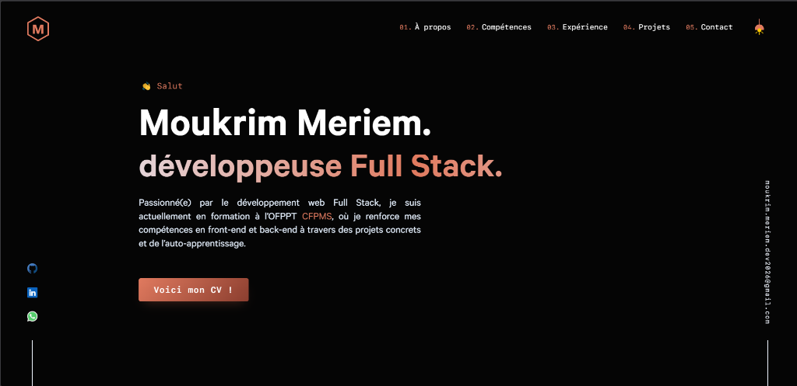

<div align="center">
  
  <br />
  <h1 align="center">Portfolio de Meriem Moukrim</h1>
  <p align="center">
    <b>Développeuse Full Stack | Passionnée par l'innovation Web</b>
  </p>
  <p align="center">
    <a href="https://github.com/meriem-moukrim">
      
    </a>
    <a href="https://www.linkedin.com/in/meriemmoukrim/">
      
    </a>
  </p>
</div>

---

## 🚀 À Propos

Bienvenue sur le dépôt de mon portfolio personnel (V4). Ce projet est une vitrine de mes compétences, de mon parcours professionnel et des projets que j'ai réalisés. Il est conçu pour être une expérience interactive, fluide et esthétique.

Actuellement en formation à **l'OFPPT CFPMS**, je me spécialise dans le développement Full Stack, avec un fort intérêt pour les interfaces modernes et réactives.

## 📱 Aperçu

### 💻 Desktop

<div align="center">
  
</div>

<br />


## ✨ Fonctionnalités Clés

- **Design Responsive** : Une expérience utilisateur fluide sur mobile, tablette et ordinateur.
- **Animations Fluides** : Utilisation de `CSSTransition` et `Styled Components` pour des transitions élégantes.
- **Mode Sombre** : Thème sombre par défaut pour une esthétique moderne "Cyberpunk/Sci-Fi".
- **Sections Dynamiques** :
  - **Hero** : Introduction animée avec liens sociaux.
  - **Expérience** : Navigation par onglets pour visualiser le parcours.
  - **Projets** : Mise en avant des travaux réalisés avec images et liens.
  - **Contact** : Formulaire et informations de contact directs.

## 🛠 Stack Technique

Ce portfolio est construit avec des technologies modernes pour garantir performance et maintenabilité :

| Catégorie       | Technologies                                              |
| :-------------- | :-------------------------------------------------------- |
| **Framework**   | [Gatsby](https://www.gatsbyjs.com/) (React)               |
| **Langage**     | JavaScript (ES6+)                                         |
| **Styles**      | [Styled Components](https://styled-components.com/), CSS3 |
| **Contenu**     | Markdown (pour la gestion facile des projets/jobs)        |
| **Déploiement** | Vercel (via GitHub)                                 |

## 📂 Structure du Projet

Voici une vue d'ensemble de l'organisation des fichiers :

```bash
/
├── content/          # Fichiers Markdown (Données des projets, expériences)
│   ├── jobs/         # Expériences professionnelles
│   ├── projects/     # Projets présentés
│   └── ...
├── src/
│   ├── components/   # Composants React réutilisables (Layout, Nav, Sections...)
│   ├── fonts/        # Polices locales
│   ├── images/       # Images et logos du site
│   ├── pages/        # Pages principales (index, 404)
│   ├── styles/       # Styles globaux et thèmes
│   ├── utils/        # Fonctions utilitaires et hooks
│   └── config.js     # Configuration principale (liens, email, réseaux sociaux)
├── static/           # Fichiers statiques publics (CV, images README)
└── gatsby-config.js  # Configuration des plugins Gatsby
```

## 🚀 Installation et Démarrage Local

Si vous souhaitez cloner et lancer ce projet localement :

1.  **Cloner le dépôt :**

    ```bash
    git clone https://github.com/meriem-moukrim/-v4-main.git
    cd -v4-main
    ```

2.  **Installer les dépendances :**

    ```bash
    npm install
    ```

    _(Note : Assurez-vous d'avoir Node.js installé)_

3.  **Lancer le serveur de développement :**

    ```bash
    npm run develop
    ```

    Le site sera accessible sur `http://localhost:8000`.

4.  **Construire pour la production :**
    ```bash
    npm run build
    ```

---

<div align="center">
  <b>Merci de votre visite ! 👋</b>
</div>
